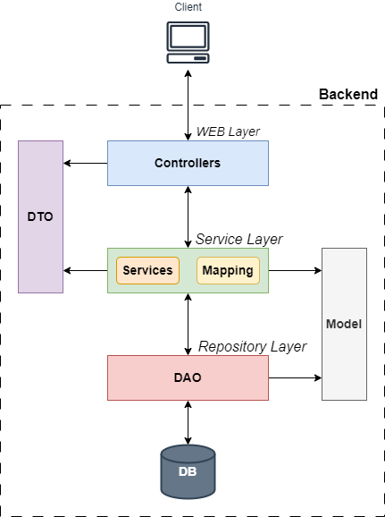

## Система управлениями проектами

### 1. Архитектура

### 2. Описание модулей

1. **WEB Layer** - принимает запросы и отдает ответ клиенту.
2. **Service Layer** - бизнес-логика, выполняет какие-либо операции над данными для решения поставленных задач.
   - **Services** - интерфейсы и реализующие их классы для работы с данными.
   - **Mapping** - преобразование модели в DTO и обратно.
3. **DTO** - модель представления. Те сущности, с которыми работает представление.
4. **Model** - модель данных, с которой работает слой бизнес-логики.
5. **Repository Layer** - работа с БД.

### 3. Декомпозиция работы
1. Проектирование - архитектура приложения, структура БД, API.
2. Разработка ПО - код, реализующий поставленные задачи.
3. Тестирование - покрытие тестами.
4. Развертывание - сборка проекта, использование Docker Compose, загрузка на Github.
5. ~~Убедить куратора, что я лучший, а все баги это фичи.~~

  
