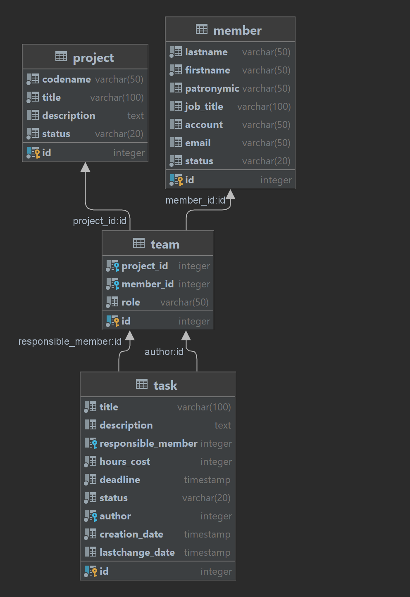

## 1. ER-модель

## 2. Описание БД
### Table: member
**Таблица описывает сущность сотрудник**

* `id         serial
constraint members_pk 
primary key,`
  * Уникальный идентификатор сотрудника
* `lastname   varchar(50)                                         not null,`
  * Фамилия (обязательное поле)
* `firstname  varchar(50)                                         not null,`
  * Имя (обязательное поле)
* `patronymic varchar(50),`
  * Отчество (не обязательное)
* `job_title  varchar(100),`
  * Должность (не обязательное)
* `account    varchar(50),`
  * Учетная запись (не обязательное), но уникальное значение среди активных сотрудников
* `email      varchar(50),`
  * Адрес электронной почты (не обязательное)
* `status     varchar(20)                                         not null
constraint check_member_status
check ((status)::text = ANY ((ARRAY ['ACTIVE'::character varying, 'REMOVED'::character varying])::text[]))
);`
  * Статус сотрудника - (обязательное поле) фиксированный набор значений (ACTIVE, REMOVE)

### Table: project
**Таблица описывает сущность проект**

* `id          serial
constraint project_pk
primary key,`
  * Уникальный идентификатор проекта
* `codename    varchar(50)  not null,`
  * Код проекта - некоторое уникальное имя проекта. Является обязательным и уникальным среди всех проектов.
* `title       varchar(100) not null,`
  * Наименование - текстовое значение содержащее короткое наименование проекта.. Обязательное поле.
* `description text,`
  * Описание - текстовое значение содержащее более детальную информацию о проекте. Не обязательное поле.
* `status      varchar(20)  not null
constraint check_project_status
check ((status)::text = ANY
((ARRAY ['DRAFT'::character varying, 'DEVELOPING'::character varying, 'TESTING'::character varying, 'FINISHED'::character varying])::text[])) `
  * Статус проекта - текстовое значение, обозначающее состояние проекта. Список статусов фиксированный (DRAFT, DEVELOPING, TESTING, FINISHED). Обязательное поле.

### Table: task
**Таблица описывает сущность задача**

* `id                 serial
constraint task_pk
primary key,`
  * Уникальный идентификатор задачи
* `title              varchar(100) not null,`
  * Наименование задачи - текстовое значение, отражающее краткую информацию о задачи (обязательное поле).
* `description        text,`
  * Описание задачи - текстовое значение, содержащее детальное описание задачи. (не обязательное поле)
* `responsible_member integer,`
  * Исполнитель задачи - сотрудник, которому необходимо исполнить задачу. (не обязательное поле). Можно выбрать исполнителя только участника проекта ( сотрудник добавленный в команду проекта). Назначить исполнителя можно только сотрудника в статусе ACTIVE.
* `hours_cost         integer      not null
constraint check_hours_cost
check (hours_cost > 0),`
  * Трудозатраты - оценка, сколько в часах необходимо на ее исполнение. (обязательное поле)
* `deadline           timestamp    not null constraint check_deadline
check (deadline > creation_date),`
  * Крайний срок - дата, когда задача должна быть исполнена. Нельзя выбрать дату если дата меньше, чем  дата создания + трудозатраты. Обязательное поле.
* `status             varchar(20)  not null
constraint check_task_status
check ((status)::text = ANY
((ARRAY ['NEW'::character varying, 'WORKING'::character varying, 'FINISHED'::character varying, 'CLOSED'::character varying])::text[])),`
  * Статус задачи - фиксированный список состояний задачи (NEW, WORKING, FINISHED, CLOSED).
* `author             integer      not null,`
  * Автор задачи - заполняется автоматически, тем кто создавал задачу. Автором задачи может являться только участник проекта.
* `creation_date      timestamp    not null,`
  * Дата создания - дата когда задача была создана.
* `lastchange_date    timestamp, constraint check_lastchange_date
check (lastchange_date >= creation_date),`
  * Дата последнего изменения задачи - дата последнего редактирования задачи (но не изменение статуса задачи).
* `constraint task_team_fk
        foreign key (responsible_member, author) references team`

### Table: team
**Группа сотрудников, объединенных общим проектом**
* `id         serial
        constraint team_pk
            primary key`
  * Уникальный идентификатор участника команды
* `project_id integer     not null
    constraint team_project_id_fk
        references project,`
  * Сущность - проект
* `member_id  integer     not null
    constraint team_member_id_fk
        references member,`
  * Сущность - сотрудник
* `role       varchar(50) not null
    constraint check_role
        check ((role)::text = ANY
               ((ARRAY ['TEAMLEAD'::character varying, 'ANALYST'::character varying, 'DEVELOPER'::character varying, 'QA'::character varying])::text[])),
`
  * Роль сотрудника. В разных командах один сотрудник может принимать различные роли, но только одну роль внутри проекта. Список ролей фиксированный: TEAMLEAD, ANALYST, DEVELOPER, QA.
